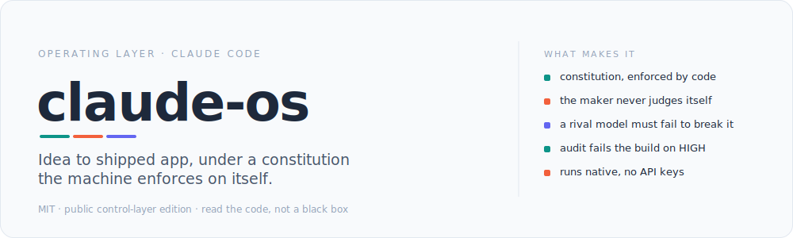
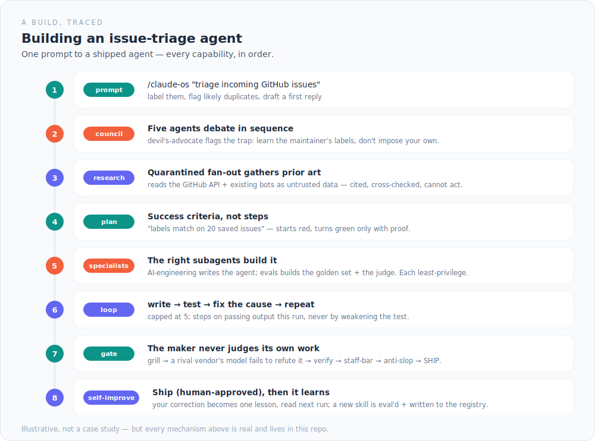
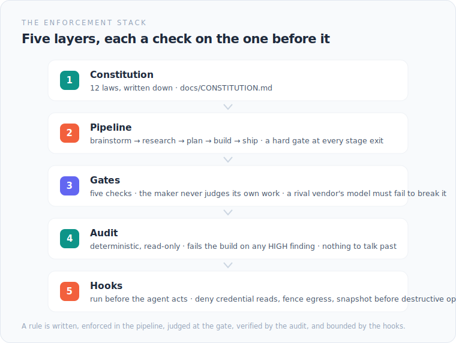

# claude-os

 &nbsp; &nbsp;

The maker never grades its own homework. Before any change ships here, a different vendor's model has to try to prove it broken — and fail. A model from the same family as the builder over-rewards its own output, so the sign-off comes from outside the family. That one rule is the spine of the whole system.

The system is claude-os: an operating layer for [Claude Code](https://claude.com/claude-code). Clone the git repo, drive it with slash commands, and it carries an idea from a prompt to a **shipped, quality-gated AI application** — under a written constitution it enforces on itself. Not a hosted app. Markdown, Python, and shell hooks you can read.

## How a build actually goes

A developer asks for an agent. It moves prompt-to-ship, every capability firing in order:

The [**full walk-through**](docs/WALKTHROUGH.md) narrates each step: the council that can kill the idea, the plan written as failing tests, the loop that can't cheat its way green, and the cross-vendor judge that has to sign off before anything ships.

## What's inside

| Capability | How it works |
|---|---|
| **Pipeline** | Six stages — brainstorm → research → plan → resources → execution → deployment — with a hard gate at every exit. |
| **The gate** | Five ordered checks. The maker never judges its own work; a *different vendor's* model must fail to refute it before ship. |
| **Loops** | Four native types (turn · goal · time · proactive) via `/goal` `/loop` `/schedule` `/autopilot`, plus a write→test→fix inner loop that stops only on passing output — never by weakening the test. |
| **Subagents** | ~25 native, least-privilege, in three groups: build specialists, quarantined researchers, and read-only judges. |
| **Self-improvement** | Every correction becomes one lesson, read next run. New skills pass an eval gate and land in a registry. A self-editing pass sits behind a kill-switch. |
| **Model routing** | Session-model-first; effort banded by role; the cross-vendor gate is never routed away. Current frontier seat: Fable 5. |
| **Harness engineering** | The bet: leverage lives in the structure around the model — plan, gates, loops, memory — not in a cleverer prompt. |

## Enforcement: a constitution the machine runs on itself

The rules aren't trusted prose. A deterministic audit fails the build on any HIGH finding, and tool-level hooks deny credential reads and fence risky agents off the network. Enforcement runs whether the agent cooperates or not.

## Status

Early, solo-built, and honest about it. This repo is the public control-layer slice: the constitution, the pipeline contract, the gate, the routing, the hooks. The ~1,500-skill library and the slash-command definitions stay private, so the code here is meant to be read, not run standalone. No adoption numbers, invented or otherwise.

## License & where to look

MIT — see [`LICENSE`](LICENSE). Take what's useful. Built on ideas from Karpathy, Cherny, Thariq, Osmani, Willison, Shankar and others, and tools from Anthropic, OpenAI (Codex), Google, and Hugging Face — [credited in full](docs/WALKTHROUGH.md).

- [`docs/WALKTHROUGH.md`](docs/WALKTHROUGH.md) — the full worked example + how each capability works
- [`docs/CONSTITUTION.md`](docs/CONSTITUTION.md) — the 12 laws, enforced in code
- [`agents/acceptance-gate.md`](agents/acceptance-gate.md) · [`bin/audit.py`](bin/audit.py) · [`bin/hooks/`](bin/hooks/)
