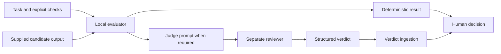

# claude-os

**From an AI product idea to a specialist-assisted build.**

claude-os organizes AI product development around **slash commands, a planning council, specialist agents, and explicit review gates**. In the full configured Claude Code system, you start with `/claude-os <idea>`: clarify the outcome, choose the right skills and specialists, agree on a plan, then hand the approved goal to `/autopilot` for implementation and verification.

This repository publishes a **runnable evaluation toolkit and selected review skills from that larger system**. The full slash-command engine and specialist roster are not bundled in this public release. You can run the local examples below today; the full-system examples describe the configured system rather than commands enabled by cloning this repository.

## What using claude-os looks like

For example, in the **full configured system**:

```text
/claude-os Build an AI support assistant that cites approved documentation and escalates uncertain answers.
```

The workflow is designed to help turn that request into a concrete product:

1. **Clarify what to build.** A planning council sharpens the idea, examines user needs and feasibility, and helps settle the goal with you.
2. **Choose the specialists.** The project advisor selects the relevant skills and agents. An AI engineering specialist can handle retrieval and agent behavior; frontend and backend specialists handle the interface and service contracts; evaluation and security specialists assess the relevant failure modes.
3. **Build against an approved goal.** `/autopilot` drives execution after the goal and success criteria are settled, coordinating the chosen specialists and verification steps.
4. **Review the result.** Separate reviewers assess the work and its evidence. External publication and deployment remain subject to human authorization.

For an existing project, `/enhance` proposes ranked improvements; accepted proposals return to the planning/build workflow. It is a proposal command, not an automatic implementation command.

The practical aim is to give a developer one coherent path from an idea to implementation, with expertise selected for the task, progress recorded, and evidence checked along the way. [See the specialist workflow and publication boundary](docs/SPECIALIST-WORKFLOW.md).

## Try the public toolkit

Requires **Python 3.10 or newer**. The evaluator uses only the standard library. No API key, paid account, package installation, or global configuration is needed for the local examples.

```sh
git clone https://github.com/sharanlabs/claude-os-public.git
cd claude-os-public
python3 bin/eval-runner.py self-test
python3 -m unittest discover -s tests -v
```

Use `python` if that is how Python 3 is named on your system. See the [walkthrough](docs/WALKTHROUGH.md) for passing, failing, and incomplete evaluations.

## What you can use today

| Component | Purpose | Boundary |
|---|---|---|
| [Evaluation runner](bin/eval-runner.py) | Check text or JSON fields; prepare judge prompts; ingest structured verdicts | Evaluates supplied outputs. Does not generate them or call a model. |
| [Task linter](bin/golden-lint.py) | Flag evaluation designs that may reward the wrong behavior | Heuristics are advisory; a clean lint is not proof that a test is good. |
| [Synthetic examples](examples/) | Exercise positive, negative, and pending-review paths | Small fixtures for software behavior, not a model benchmark. |
| [Review skills](skills/) | Structure critique, requirements questioning, and source-grounded review | Optional agent instructions; live Codex use needs your own installation and access. |
| [Tests](tests/) | Exercise the real CLI and its exit behavior | Evidence for the covered cases, not a security certification. |

## How the public evaluation pieces fit


```mermaid
flowchart LR
    A[Task and explicit checks] --> C[Local evaluator]
    B[Supplied candidate output] --> C
    C --> D[Deterministic result]
    C --> E[Judge prompt when required]
    E --> F[Separate reviewer]
    F --> G[Structured verdict]
    G --> H[Verdict ingestion]
    D --> I[Human decision]
    H --> I
```

The evaluator exits **0** for complete passing evaluations, **1** for failures, and **2** when required judgment is still pending. Treat only exit 0 as a completed pass. A separate `ingest-verdict` result does not automatically merge with an earlier run report; preserve and review both.

## What this release does not establish

The fixtures do not establish defect-detection rates, reduced maintenance time, or superiority over another reviewer. Token and latency values are supplied data, not measurements made by the runner. A model-generated verdict is still an assessment, not independent proof of correctness. See [evaluation limits](docs/EVALUATION.md).

The older `bin/audit.py`, `bin/hooks/`, and `agents/acceptance-gate.md` remain **reference material from the personal runtime**. They are not installed, enabled, or covered by the portable-toolkit CI. Some expect files and configuration that this public repository does not include. Do not use them as a fresh-clone installer or security boundary. The former public edition was a nonstandalone control-layer snapshot; this release adds a supported, runnable subset.

## Contribute

Start with a reproducible evaluation failure, an incorrectly scored candidate, or a confusing setup step. Small test cases with both a good and bad output are especially useful. Read [CONTRIBUTING.md](CONTRIBUTING.md), [security boundaries](SECURITY.md), and the [roadmap](docs/ROADMAP.md).

## License and provenance

Original project code is [MIT-licensed](LICENSE). Included third-party skills retain their own licenses and attribution; see [THIRD-PARTY-NOTICES.md](THIRD-PARTY-NOTICES.md). These integrations do not imply endorsement by OpenAI, Anthropic, or their upstream authors.

An earlier [claude-os-open architecture snapshot](https://github.com/sharanlabs/claude-os-open) is historical reference material. **This repository is the runnable public toolkit.**

Maintained by [Sharan Kumar](https://github.com/sharanlabs). [Release notes](CHANGELOG.md) · [Architecture](docs/ARCHITECTURE.md) · [Operating principles](docs/CONSTITUTION.md)
