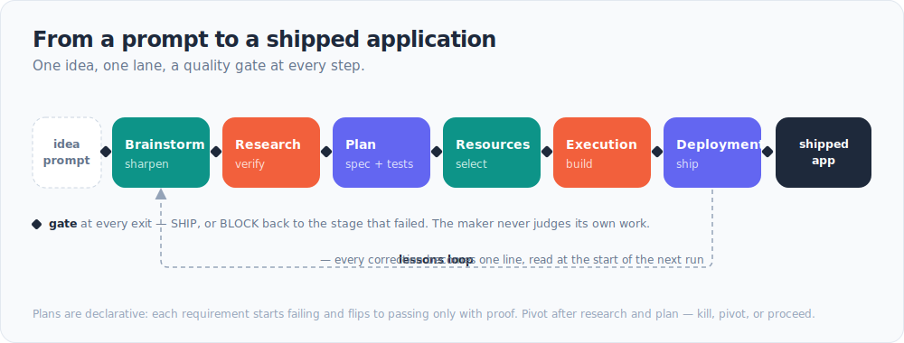
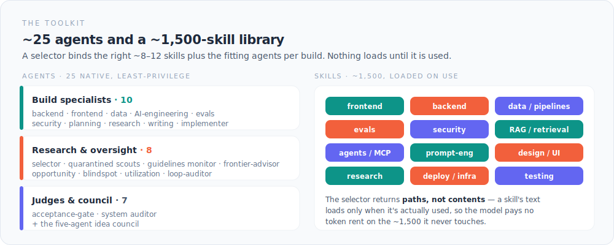
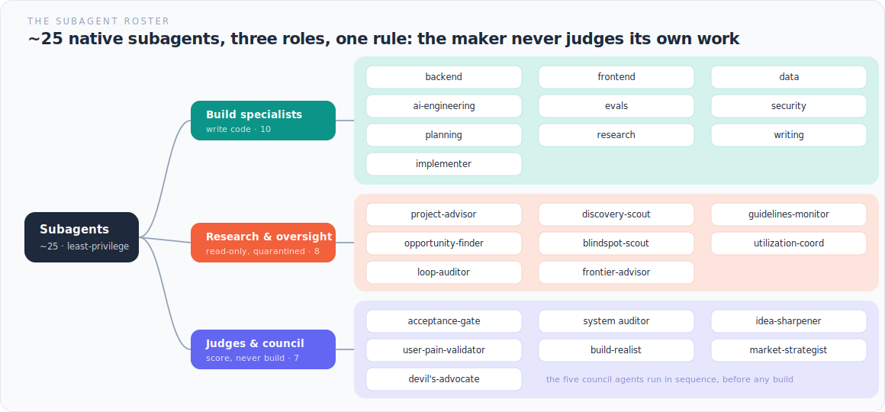

# What claude-os does, followed through one build

The maker never signs off on its own work. When the issue-triage agent below is finished, it doesn't ship because the builder says it's ready — it ships because a rival vendor's model tried to break it and couldn't. That refutation is the load-bearing check, and this page follows one real build through to it, prompt to ship, naming each capability as it fires.



claude-os is an operating layer for Claude Code. It takes an idea from a one-line prompt to a shipped, quality-gated AI application, under a written constitution the system enforces on itself.

## A worked example: building an issue-triage agent

Here is how a build goes. A developer opens the front door:

```
/claude-os "an agent that triages incoming GitHub issues — label them,
flag likely duplicates, draft a first reply"
```

What follows is illustrative, not a case study. Every mechanism below is real and lives in this repo.

### 1. Triage, and the idea council

The front door senses a product idea rather than a chore, and convenes a five-agent council. They deliberate in sequence, each writing its section to a shared file before the next one reads it. No groupthink from everyone talking at once.

`idea-sharpener` reframes "triage issues" into the outcome that matters: cut the maintainer's time-to-first-response. `user-pain-validator` asks whether that pain is real for the people who'd use this. `build-realist` names the smallest wedge that ships. `market-strategist` checks what existing triage bots already do, so the build isn't reinventing a solved problem. Then `devil's-advocate` — the only agent licensed to kill the idea — flags the trap: label taxonomies differ per repo, so an agent that imposes its own labels is useless to a maintainer who already has a system. The agent has to learn the maintainer's taxonomy, not fight it.

Output: a sharpened scope, or a logged kill. A dead idea caught here is the cheapest win the whole system produces.

### 2. Research, quarantined

Fan-out subagents gather prior art in parallel: existing triage actions, the GitHub issues API, how people dedup issues in practice. Everything they pull from the web is treated as untrusted data. These readers can read, classify, and summarize — nothing else. They hold no secrets, run no shell, and never fetch a URL that appeared inside content they already fetched. A separate, trusted agent acts on their findings and never touches the raw pages.

That split is a hard rule, enforced on the private-data side by a deterministic hook. An agent that reads the open web and can also act and exfiltrate is the exact shape of a prompt-injection disaster. Findings come back cited and cross-checked against more than one source.

### 3. A declarative plan

The plan is not a list of steps. It's a set of success criteria and the tests that prove them.

> On 20 saved issues, labels match the maintainer's taxonomy.
> Each flagged duplicate links to the original.

Every item starts red. It turns green only when there's proof. You give the machine what "done" looks like and let it find the path, instead of dictating the path and hoping it reaches done.

### 4. Resources: the right specialists

A selector binds the working set for this build: an AI-engineering specialist to write the agent, an evals specialist to build the golden set of issues and the judge that scores against it, the GitHub skills. Each subagent runs least-privilege, with a context clean of everything unrelated to its job. The selector returns paths, not contents — a skill's text loads only when it's actually used, so the model isn't paying token rent on capabilities it never touches.

### 5. Execution and the inner loop

The specialist builds. Every change runs a loop, not a line: write, run the real checks (the golden-issue tests, actually executed), and if they're red, fix the cause and re-check. Five attempts, then stop and report. The loop stops on passing output from this run — not on the model announcing it's done.

It never turns green by weakening a test. That's forbidden by rule and enforced by a hook, because a model told to "make it pass" will loosen the test if you let it. Reward-hacking is measured and real. The fix is to make the check something the builder can't quietly edit.

### 6. The gate: the maker never judges its own work

The finished agent goes to an independent judge that runs five checks in order: grill it for hand-waving, then let a different vendor's model (Codex) try to refute that it works, then verify correctness with proof rather than assertion, then a staff-engineer bar, then anti-slop. The judge returns SHIP, or BLOCK with the exact stage to route back to.

The builder gets no vote on its own work. Same-family models over-reward their own output — a judge from the same family as the maker will pass things it shouldn't. So the cross-vendor refutation isn't a nice-to-have. It's the load-bearing check, and it's never optional.

### 7. Deployment, gated

The agent ships through exposure tiers — local, then internal, then public — each an explicit step. Anything that would post to a live repo is human-approved, every time, because it's irreversible. The system snapshots the filesystem well and automates reversible work freely; the moment an action can't be taken back, a person decides.

### 8. Self-improvement, afterward

You correct it once: "don't auto-close duplicates, just link them." That correction becomes one line in a lessons file, read at the start of the next run. The same mistake never ships twice — and if it does, the system failed, not you.

If no existing skill fit the dedup step, a new skill is generated, scored against an eval, passed through a trust gate, and written into a capability registry so it's never rebuilt from scratch. The improvement lives in the repo, not in the model. That's why the system compounds over time and stays model-agnostic: swap the underlying model and the accumulated judgment, lessons, and skills come with it.

## The same machine, a different job

The pipeline isn't specific to code. Point it at a finance task — `/claude-os "an agent that matches each monthly invoice to its purchase order and flags mismatches for a human to approve"` — and the same stages fire. The council reframes "match invoices" into the outcome that matters: cut the hours a finance team spends reconciling, without ever letting a wrong invoice through. The plan becomes tests: on a month of real invoices, every mismatch over a threshold is caught and linked to its purchase order, and nothing is auto-approved. The gate still needs a rival model to sign off. And deployment draws the same hard line the code example did — the agent flags and drafts, but a person approves every payment, because money leaving the account can't be taken back. That rule isn't a policy bolted on for finance; it's the do-no-harm law the whole system already runs under.

## How the capabilities work

A compressed reference, so you can find each piece.



**The pipeline.** Six stages: brainstorm, research, plan, resources, execution, deployment. The main session runs them — orchestration is a script, not a supervising meta-agent, because wrapping orchestration in a subagent loses the context that makes it coherent. Four feedback loops thread through: a pivot checkpoint (kill / pivot / proceed), debugging as a first-class stage, failure-to-lesson capture, and an end retrospective.

**The gate.** Five ordered checks — grill, cross-vendor refutation, verify-with-proof, staff-engineer-plus-taste, anti-slop. The judge is read-only and always separate from the maker. It defaults to BLOCK: a pass it didn't work for is a failed gate. High-stakes and irreversible calls go to the owner rather than the model.

**Loops.** Four native types, keyed by what you can hand off: turn-based (you hand off the check), goal-based (you hand off a verifiable stop condition), time-based (you hand off the trigger), and proactive (you hand off the whole recurring prompt) — driven by `/goal`, `/loop`, `/schedule`, `/autopilot`. A loop only pays off when the task recurs, verification is automated, the budget can absorb the wasted runs, and the agent can actually run what it writes. Miss one of those and the right answer is a single well-aimed prompt, no loop.

**Self-improvement.** Every owner correction becomes a lesson, read at the next session's start. Skills are created on demand only when nothing existing fits, and only behind an eval plus a trust gate. A capability registry keeps the ledger so nothing gets built twice. A recursive self-improvement pass — where the system edits its own components — is walled behind deterministic guards and a kill-switch, so the loop can never edit its own brakes: a change that weakens a check, touches too many files, or trips the self-modification firewall is auto-reverted before a human ever sees it.

**The subagents.** About 25 native ones, each least-privilege, in three functional groups: build specialists that write code, read-only research and discovery agents that are quarantined from acting, and the gate and judge agents that score but never build. The boundaries are enforced by tool allowlists and hooks, not by good intentions.



**Model routing.** Session-model-first: delegated work inherits the session model, and effort is banded by role — maximum where judgment compounds (planning, review, security), lighter on mechanical work. The current frontier seat is Fable 5; a cheaper tier runs a step only when its output would be provably identical. The cross-vendor gate (Codex) is never routed away, whatever the frontier model happens to be.

**Failure-knowledge.** Where AI agents fail is treated as first-class data. Known failure modes — a self-reviewed bug that reads as competent work, a hallucinated reference, a reward-hacked test — are each logged with the fix that beats them, and the pipeline screens for those modes on the way past. The system is built against a documented failure frontier, not just toward a happy path.

**Do-no-harm and rewind.** Before any destructive operation — a delete, an overwrite, a force-push — a hook snapshots the filesystem, so a bad step is one command to undo. This isn't decoration: the repo exists because an unguarded bulk delete once wiped a skills library. Reversible work runs freely; irreversible work waits for a person.

**Continuity and resumability.** State lives in files, not in a session. Any account, on any machine, reads the same "next action" and resumes the exact step the last one left. A usage-cap death mid-run is never a stop — the work picks up where it paused. The context is the asset; losing a session loses nothing.

**Harness engineering, the frame.** The bet underneath all of it: leverage lives in the structure around the model — the plan file, the gates, the loops, the quarantine, the lessons — not in a cleverer prompt. A stronger model makes a good harness better; it doesn't replace one.

## Built on — sources and tools

claude-os draws widely on the practitioner and research community, and cross-checks every load-bearing claim against a primary source. These are credited as influences and tools, not endorsements — the mechanisms in this repo are the author's own, and nothing here implies affiliation.

**Ideas and patterns**

- Declarative goals — success criteria, not steps — from **Andrej Karpathy** and **Boris Cherny**.
- The native loop taxonomy (turn / goal / time / proactive), from the Claude Code team's "Getting started with loops" (**de Oliveira & Segner**).
- Verification as the highest-ROI skill, and the three-layer verify architecture — **Thariq**.
- Loop engineering, and the comprehension-debt and cognitive-surrender failure modes — **Addy Osmani**; "design loops, don't prompt" — **Peter Steinberger**.
- The Rule of Two for agent security — **Simon Willison**.
- Evals and error-analysis discipline — **Shreya Shankar**.
- Self-preference bias, measured — **Eugene Yan**.
- Dynamic-workflow patterns — **Kashef**.
- Agent-architecture reference — **LangChain / Harrison Chase**.
- The persistence of reward-hacking under pressure — **Berkeley RDI**.

**Tools and models**

- **Claude Code** and **Anthropic's** interpretability and loop/harness research — the substrate the system runs on.
- **Codex** (OpenAI) — the cross-vendor model that has to refute a change before it ships; plus OpenAI's "The Attacker Moves Second" on why filter defenses fail.
- **Fable 5** — the current frontier model seat (the system is model-agnostic; this is whichever frontier model holds the session).
- **Google Gemini** and **Hugging Face** — tools in the working set.

## Honest status and where to look

This is an early system, built by one person. This public repo is the control-layer slice: the constitution, the pipeline contract, the gate, the routing, the hooks. The roughly 1,500-skill library and the slash-command definitions stay private. There are no adoption metrics here, invented or otherwise; the claims above describe mechanisms in the repo, not results in the wild.

The source of truth for each piece:

- `CONSTITUTION.md` — the 12 laws, enforced in code
- `../agents/acceptance-gate.md` — the gate panel, made runnable
- `../bin/audit.py` — the deterministic auditor that fails the build on a HIGH finding
- `../bin/hooks/` — the enforcement layer: the trifecta guard, the egress guard, the loop-verify Stop hook, the self-improve firewall, and the rest
